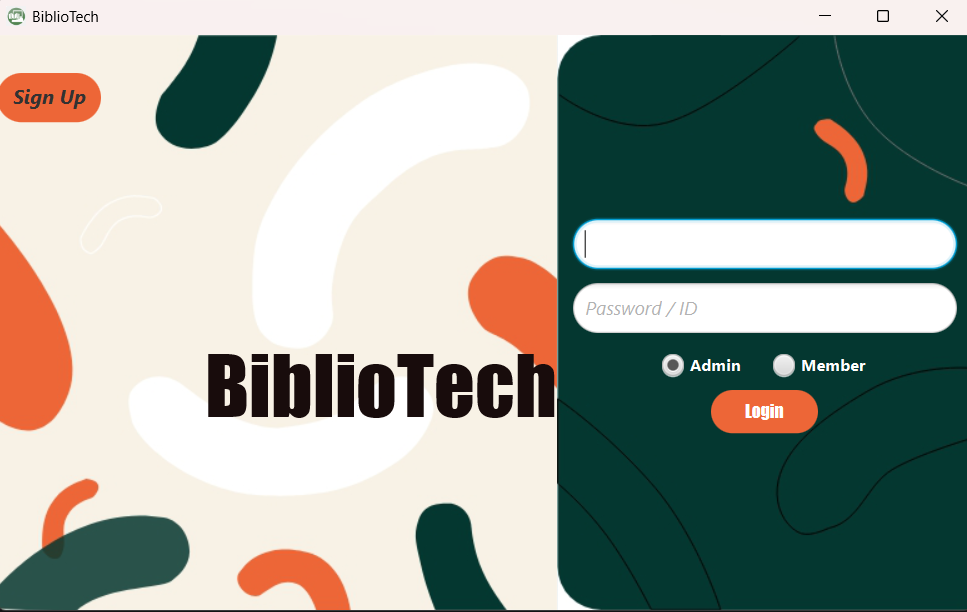
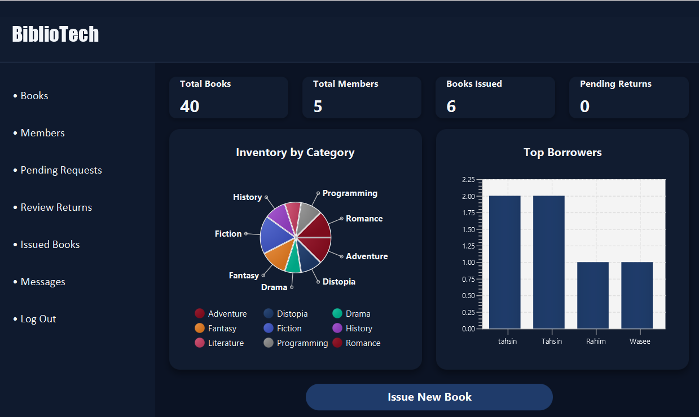
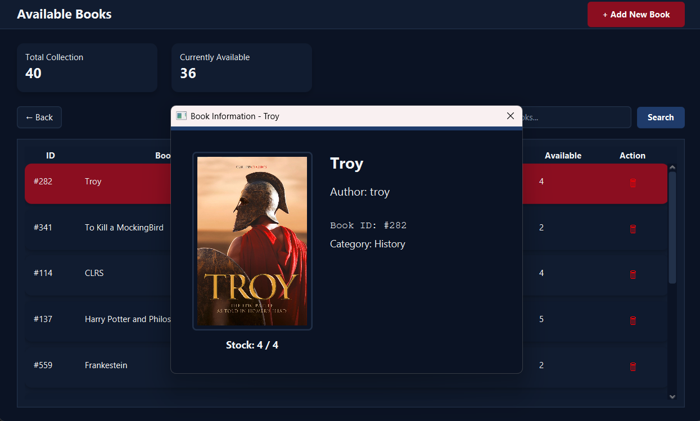
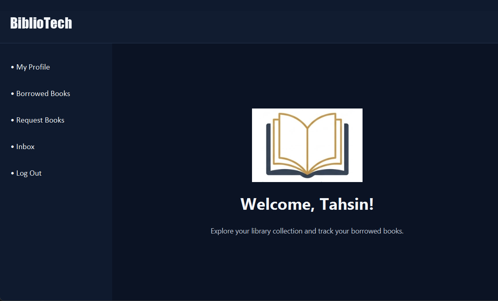

<div align="center">

<br/>

<!-- Replace the src below with your actual project banner/logo image -->


<br/><br/>

# 📚 BiblioTech
### A Professional Library Management System

<p>
  
  
  
  
  
</p>

<p><i>A comprehensive, dual-role Library Management System built with JavaFX 21, SQLite, and a cinematic "Executive Dark" theme — engineered for real-world library operations.</i></p>

<p>
  <b>Course:</b> CCSE 108 — Object Oriented Programming &nbsp;|&nbsp;
  <b>Department:</b> CSE, BUET
</p>

---

</div>

<br/>

## 🖥️ Application Preview

<div align="center">

|                                  Login Portal                                  |                                   Admin Dashboard                                   |
|:------------------------------------------------------------------------------:|:-----------------------------------------------------------------------------------:|
|  |  |

|                                Book Catalog                                |                                  Member Portal                                   |
|:--------------------------------------------------------------------------:|:--------------------------------------------------------------------------------:|
|  |  |


</div>

---

## 📋 Table of Contents

- [About the Project](#-about-the-project)
- [Tech Stack](#️-tech-stack)
- [Features](#-features)
- [Getting Started](#-getting-started)
    - [Prerequisites](#prerequisites)
    - [Installation](#installation)
    - [Running the App](#running-the-app)
- [Default Credentials](#-default-credentials)
- [Project Structure](#-project-structure)
- [Authors](#-authors)
- [Supervisor](#-supervisor)
- [Acknowledgements](#-acknowledgements)

<br/>

---

## 📖 About the Project

**BiblioTech** is a full-featured, professional-grade desktop Library Management System developed as a course project for CCSE 108 at BUET. It simulates a real-world library operation environment with a **dual-role portal system** (Admin & Member), real-time data visualization, a built-in messaging hub, and a self-healing SQLite database — all wrapped in a cinematic, high-contrast **"Executive Dark"** UI theme.

<br/>

---

## 🛠️ Tech Stack

| Layer | Technology |
|---|---|
| **Language & SDK** | Java 21 LTS — BellSoft Liberica JDK (Full) |
| **UI Framework** | JavaFX 21 — FXML (layout) + CSS (Executive Dark theme) |
| **Build System** | Gradle with Kotlin DSL |
| **Database** | SQLite via JDBC (Xerial driver) |
| **Frontend Bridge** | JavaFX WebView + JavaScript–Java Bridge |
| **Packaging** | `org.beryx.jlink` + `jpackage` (self-contained `.exe` installer) |

### Gradle Plugins
- `org.openjfx.javafxplugin` — Modular JavaFX integration
- `org.javamodularity.moduleplugin` — Strict JPMS compliance
- `org.beryx.jlink` & `jpackage` — Cross-platform installer generation

### Third-Party Libraries
- **ControlsFX** — Advanced UI components
- **TilesFX** & **JavaFX Charts** — Data visualization
- **FormsFX** & **ValidatorFX** — Form handling and validation

<br/>

---

## ✨ Features

<details>
<summary><b>🎨 Professional UI & UX</b></summary>

<br/>

- **Cinematic Landing Page** — A high-end HTML/CSS intro rendered via WebView as the application's first entry point
- **Unified "Executive Dark" Theme** — High-contrast, consistent interface across all Admin and Member windows
- **Glow & Classic Button Effects** — Custom CSS hover states for tactile interactive feedback
- **Premium TableViews** — Modern row spacing with `fixedCellSize` and Constrained Resize Policy

</details>

<details>
<summary><b>🔐 Dual-Role Portal System</b></summary>

<br/>

- **Admin Control Center** — Staff dashboard to manage the full library lifecycle
- **Member Personal Portal** — Private space to discover books, manage borrowed items, and update profiles
- **Dynamic Role-Based Login** — A unified login screen that routes users to their respective portal based on database credentials

</details>

<details>
<summary><b>📦 Advanced Inventory & Stock Management</b></summary>

<br/>

- **Multiple Copies Logic** — Tracks *Total Copies* (owned) vs. *Available Copies* (on the shelf) per book
- **Visual Cataloging** — File-management pipeline to upload book covers from disk, copying them into the project directory
- **Master-Detail Pattern** — Double-click popups showcasing detailed book info, categories, and large cover images
- **Self-Healing Database** — Automatic table creation and data migration on first run

</details>

<details>
<summary><b>🔄 Transaction & Verification Pipeline</b></summary>

<br/>

- **Two-Step Return Verification** — An "Appeal-and-Accept" system: members request returns, admins verify and approve
- **Automated Lending** — One-click book issuance with automatic stock decrement
- **Stock Recovery Logic** — Failsafe that restores "Available" status if a member is deleted or a return is approved

</details>

<details>
<summary><b>💬 Integrated Communication Hub</b></summary>

<br/>

- **Real-Time Chat Interface** — Built-in messaging with a Messenger-style UI
- **Message Persistence** — Database-driven chat logs per Admin–Member pair
- **Conditional Bubble Styling** — Left-aligned (received) vs. right-aligned (sent) chat bubbles

</details>

<details>
<summary><b>📊 Data Visualization & Search</b></summary>

<br/>

- **Executive Analytics** — Real-time Pie Charts (Inventory by Category) and Bar Charts (Top Borrowers)
- **Live Search & Filtering** — Instant filtering using `FilteredList` and `SortedList` as you type
- **Real-Time Stats** — Live counters for Total Books, Active Members, Issued Books, and Pending Requests

</details>

<details>
<summary><b>🔒 Security & Data Integrity</b></summary>

<br/>

- **SQL Injection Prevention** — Universal use of `PreparedStatement` to sanitize all inputs
- **Atomic Transactions** — `setAutoCommit(false)` with `commit/rollback` logic for "All-or-Nothing" operations
- **ID Uniqueness Validation** — Recursive duplicate-check for auto-generated Book and Member IDs
- **Self-Service Profiling** — Secure member profile updates with the unique ID locked

</details>

<br/>

---

## 🚀 Getting Started

### Prerequisites

Before running BiblioTech, ensure you have the following installed:

| Requirement | Version | Notes |
|---|---|---|
| **BellSoft Liberica JDK (Full)** | 21 (LTS) | Full version includes JavaFX — [Download here](https://bell-sw.com/pages/downloads/#jdk-21-lts) |
| **Gradle** | 8.x+ | Or use the included `./gradlew` wrapper |
| **Git** | Any | For cloning the repository |

> ⚠️ **Important:** You must use **BellSoft Liberica JDK Full** (not standard OpenJDK), as it bundles JavaFX 21 required by the project.

<br/>

### Installation

**1. Clone the repository**

```bash
git clone https://github.com/YOUR_USERNAME/BiblioTech.git
cd BiblioTech
```

**2. Verify your JDK**

```bash
java -version
# Expected output: openjdk version "21.x.x" ... Liberica
```

**3. Build the project**

```bash
# On Linux / macOS
./gradlew build

# On Windows
gradlew.bat build
```

> If you encounter any dependency issues, run `./gradlew --refresh-dependencies build`

<br/>

### Running the App

**Option A — Run directly with Gradle (Recommended for development)**

```bash
./gradlew run
```

**Option B — Build a self-contained installer (Windows)**

```bash
./gradlew jpackage
```

This generates a standalone `.exe` installer in `build/jpackage/`. No JDK required on the target machine.

**Option C — Run the JAR directly**

```bash
./gradlew jar
java -jar build/libs/BiblioTech.jar
```

<br/>

---

## 🔑 Default Credentials

Use the following credentials to explore both portals on first launch. The database is auto-initialized on startup.

<div align="center">

### 👨‍💼 Admin Portal

| Field | Value |
|:---:|:---:|
| **Username / ID** | `admin` |
| **Password** | `admin123` |

### 👤 Member Portal

| Field | Value |
|:---:|:---:|
| **Username / ID** | `MEM001` |
| **Password** | `member123` |

</div>

> 💡 You can create additional admin and member accounts from the Admin Control Center after logging in.

<br/>

---


## 👨‍💻 Authors

<div align="center">

<table>
  <tr>
    <td align="center">
      <b>Tanzimul Hasan Tahsin</b><br/>
      <sub>Student</sub><br/>
      <sub>Bangladesh University of Engineering and Technology</sub>
    </td>
    <td align="center">
      <b>MD Tamim Chowdhury</b><br/>
      <sub>Student</sub><br/>
      <sub>Bangladesh University of Engineering and Technology</sub>
    </td>
  </tr>
</table>

</div>

<br/>

---

## 🎓 Supervisor

<div align="center">

**MD Mahfuzul Islam**
<br/>
Professor, Department of Computer Science and Engineering
<br/>
Bangladesh University of Engineering and Technology (BUET)

</div>

<br/>

---

## 🙏 Acknowledgements

- **Course:** CCSE 108 — Object Oriented Programming, BUET
- [BellSoft Liberica JDK](https://bell-sw.com/) for the Full JDK with bundled JavaFX
- [ControlsFX](https://controlsfx.github.io/) for extended JavaFX UI components
- [TilesFX](https://github.com/HanSolo/tilesfx) by HanSolo for dashboard tiles
- [Xerial SQLite JDBC](https://github.com/xerial/sqlite-jdbc) for the embedded database driver
- [FormsFX](https://github.com/dlsc-software-consulting-gmbh/FormsFX) & [ValidatorFX](https://github.com/effad/ValidatorFX) for form handling

<br/>

---

[//]: # (<div align="center">)

[//]: # ()
[//]: # (Made with Java at **BUET CSE**)

[//]: # ()
[//]: # (</div>)